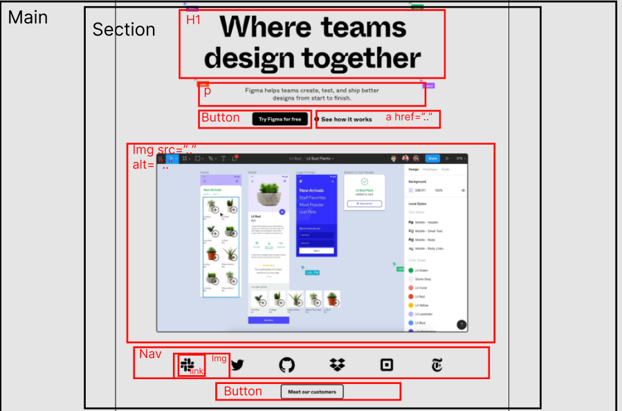

# Procesverslag

**Auteur:** Ayse Agircan

Markdown cheat cheet: [Hulp bij het schrijven van Markdown](https://github.com/adam-p/markdown-here/wiki/Markdown-Cheatsheet). Nb. de standaardstructuur en de spartaanse opmaak zijn helemaal prima. Het gaat om de inhoud van je procesverslag. Besteedt de tijd voor pracht en praal aan je website.

## Bronnenlijst

1. -bron 1-
2. -bron 2-
3. -...-

## Eindgesprek (week 7/8)

-dit ging goed & dit was lastig-

**Screenshot(s):**

-screenshot(s) van je eindresultaat-

## Voortgang 3 (week 6)

-same as voortgang 1-

## Voortgang 2 (week 5)

-same as voortgang 1-

## Voortgang 1 (week 3)

-dit ging goed & dit was lastig-
Het positioneren van elemeneten vond ik nog best lastig. Daarnaast kreeg ik mijn icons niet zoals ik ze wilde hebben. Mijn afbeelding scalen ging daarentegen perfect.

**Screenshot(s):**

-screenshot(s) van hoe ver je bent-

### Stand van zaken

-dit ging goed & dit was lastig-
Wat ik best lastig vond was het vinden van de iconen en de afbeeldingen die de site gebruikt. Nadat ik eenmaal wist hoe ik het kon vinden, was het best makkelijk en snel. Er zijn echter wel een paar complicaties waar ik tegen aanloop. Sommige afbeeldingen zijn geen afbeeldingen, maar een stukje video. Ik heb geen idee hoe ik deze moet toevoegen in mijn HTML. Behalve dat ging het best prima.

**Screenshot(s):**

-screenshot(s) van hoe ver je bent-

### Agenda voor meeting

-samen met je groepje opstellen-

### Verslag van meeting

-na afloop snel uitkomsten vastleggen-

## Intake (week 1)

**Je startniveau:** Rode piste.

**Je focus:** Eigenlijk wil ik beiden doen, maar zal eerst mijn focus leggen op responsiveness.

**Je opdracht:** http://www.figma.com

**Screenshot(s):**

, , 

**Breakdown-schets(en):**

 
